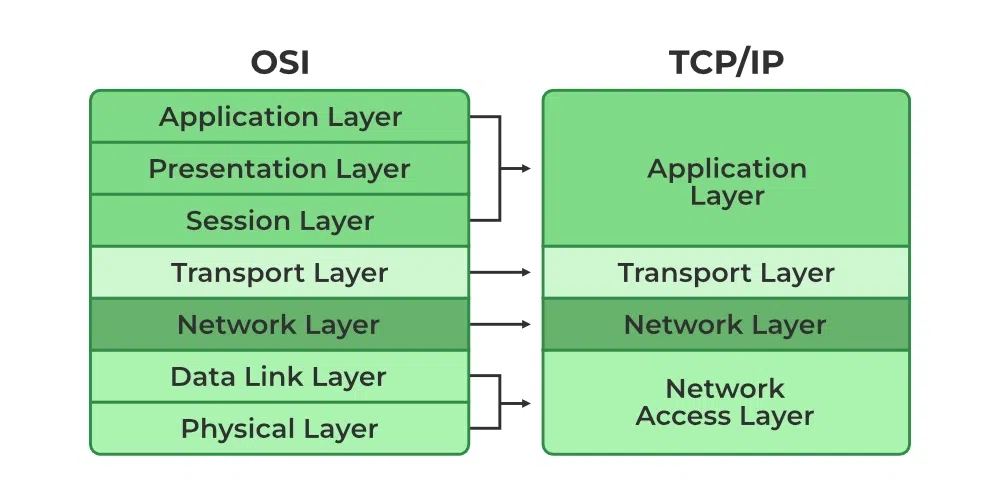

## HTTP vs HTTPS

Both are application level protocol. HTTPS is built over http with data encryption using TLS certificate. HTTPS Encryption, Authentication (certificate) & Integrity.

| HTTP                  |     HTTPS        |
|-----------------------|------------------|
|defualt port 80        | default port 443 |
|plain text             | encrypted data   |
|not secure             | secure           |

## OSI & TCP/IP Model

### OSI model 
 (Open Systems Interconnection) model is a conceptual 7-layer framework developed by the ISO to standardize how different computer systems communicate, dividing network interaction into manageable stages
 ### TCP/IP
 (Transmission Control Protocol/Internet Protocol) model is mostly used framework on internet.

### Layers Summary

*   #### Physical Layer
    *   **Function:** Converts bits into physical signals (e.g., electrical, light) for transmission over a medium.

*   #### Data Link Layer
    *   **Function:** Packages data into **frames**, adding MAC addresses for local network delivery and performing error checking.

*   #### Network Layer
    *   **Function:** Handles **IP addressing** and **routing** to move packets across different networks to their final destination.

*   #### Transport Layer
    *   **Function:** Manages end-to-end communication between applications.
    *   **Protocols:** **TCP** (reliable, connection-oriented) and **UDP** (fast, connectionless).

*   #### Session Layer
    * **Function**: Establishes, manages, and terminates **communication sessions** between two devices.

*   #### Presentation Layer
    * **Function**: **Translates, encrypts, and compresses data** to ensure it's in a usable format for the application layer. 

*   #### Application Layer
    *   **Function:** Provides protocols for network services that users interact with.
    *   **Protocols:** HTTP (web), DNS (name resolution), SMTP (email), FTP (file transfer).

## Internet Request Lifecycle

#### Pre-req

* **Webpage**: A webpage is a text file written in HTML that browsers can understand and display.
* **Server**: Webpages are stored on servers, which send the content when users request it.
* **IP Address**: Servers have unique IP addresses that act like addresses for communication.
* **Protocols**: Data is transferred using protocols like TCP (reliable) and UDP (faster but less reliable).
* **TCP (Transmission Control Protocol)** ensures reliable delivery by sending data in packets and confirming each one; used for websites, downloads, and emails. It allows resuming downloads if the connection drops, but is **slower** due to constant verification.
* **UDP (User Datagram Protocol)** sends data quickly without checking delivery; used for live streaming and online gaming. It is **faster but unreliable**, meaning lost data is not recovered (e.g., missed parts of a live stream).

### What actually happens:

* So the first thing that happens is that your browser looks up in its cache to see if that website was visited before and the IP address is known. 
* If it can't find the IP address for the URL requested then it asks your operating system to locate the website. The first place your operating system is going to check for the address of the URL you specified is in the host file. If the URL is not found inside this file, then the OS will make a DNS request to find the IP Address of the web page.
* The first step is to ask the Resolver (or Internet Service Provider) server to look up its cache to see if it knows the IP Address, if the Resolver does not know then it asks the root server to ask the .COM TLD (Top Level Domain) server - if your URL ends in .net then the TLD server would be .NET and so on - the TLD server will again check in its cache to see if the requested IP Address is there. 
* If not, then it will have at least one of the authoritative name servers associated with that URL, and after going to the Name Server, it will return the IP Address associated with your URL. All this was done in a matter of milliseconds WOW!
* After the OS has the IP Address and gives it to the browser, it then makes a GET (a type of HTTP Method) to said IP Address. When the request is made the browser again makes the request to the OS which then, in turn, packs the request in the TCP traffic protocol we discussed earlier, and it is sent to the IP Address. 
* On its way, it is checked by both the OS' and the server's firewall to make sure that there are no security violations. And upon receiving the request the server (usually a load balancer that directs traffic to all available servers for that website) sends a response with the IP Address of the chosen server along & TLS Handshake happens to initiate a secure session (HTTPS), server sends TLS certificate during handshake. 
* Finally, the chosen server then sends the HTML, CSS, and Javascript files (If any) back to the OS who in turn gives it to the browser to interpret it. And then you get your website as you know it.

>In Summary, when a user enters a URL in the browser, the following happens:
>
> 1. **DNS Resolution**
>
>    * Browser checks cache → OS → ISP resolver
>    * If not found, queries root → TLD → authoritative server
>    * Gets IP address
> 2. **Connection Establishment**
>
>    * Browser establishes TCP connection using **3-way handshake**
> 3. **TLS Handshake (for HTTPS)**
>
>    * Server sends certificate
>    * Browser verifies it
>    * Secure encrypted channel is established
> 4. **HTTP Request**
>
>    * Browser sends HTTP request (e.g., GET)
> 5. **Server Processing**
>
>    * Request may go through load balancer → backend server
> 6. **Response**
>
>    * Server sends HTML, CSS, JS
> 7. **Rendering**
>
>    * Browser parses HTML → builds DOM → renders page
